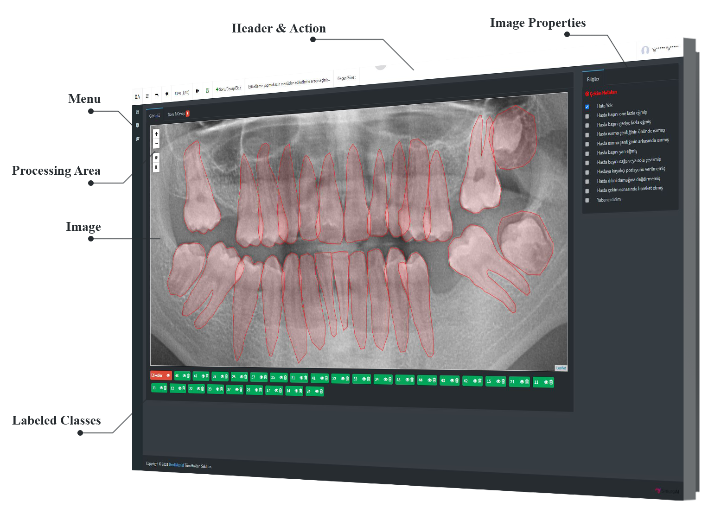

# Automatic Dental Segmentation Module Supported by Artificial Intelligence for Dentistry Students Education (DentiAssist)
In this study, DentiAssist, a web-based radiological image analysis and labeling application supported by artificial intelligence, was developed for the education of dentistry students. The necessary legal permissions regarding the panoramic tooth images were obtained and ten students from the Faculty of Dentistry of Karabuk University were included in the study. In the AI-based analysis of the study, Mask R-CNN was used to detect and divide the teeth, providing information about the positions of the teeth in the region of interest and the pixels of the teeth. Using the labeling module of DentiAssist software, 649 training and 279 validation data, precisely labeled by three maxillofacial radiologists, were given as input into the neural network and a feature map was created with the convolutional neural network. At the pixel level, a mask was produced for each tooth and tooth detection was carried out with the Region of Interest Alignment module. Using an equal number of 100 test images, mAP (mean average precision) was measured 97.75% because of student and artificial intelligence comparison, and 99.02% success was achieved in radiologist and artificial intelligence comparison.

# Labeling Module

Labeling screen and segmentation module components has been shown in Figure 1.
<figure>
<p align="center">
    
</p>
<figcaption align="center"><b>Figure 1: Screen of labeling module</b></figcaption>
</figure>

# Citation
If you use this research paper, please cite:

A. Karaoglu, C. Ozcan, A. Pekince, Y. Yaşa, B.Y. Tekin, D. Ozdemir, Automatic Dental Segmentation Module Supported by Artificial Intelligence for Dentistry Students Education, Artificial Intelligence Theory and Applications 1(2): 180-190 (Special Issue), 2021.

```
@article{karaoglu2021artificial,
  title={Automatic Dental Segmentation Module Supported by Artificial Intelligence for Dentistry Students Education},
  author={Karaoglu, Ahmet and Ozcan, Caner and Pekince, Adem and Yasa, Yasin and Tekin, Buse Yaren and Ozdemir, Dilara},
  journal= {Artificial Intelligence Theory and Applications},
  volume={1},
  pages={180--190},
  year={2021}
}
```

# Request Full Paper

Please click to access the article; https://www.researchgate.net/publication/353306237_Automatic_Dental_Segmentation_Module_Supported_by_Artificial_Intelligence_for_Dentistry_Students_Education